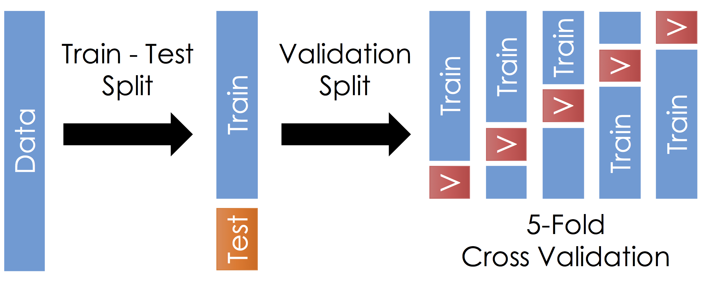

```{r setup, include=FALSE}
knitr::opts_chunk$set(echo = TRUE)
```

```{r, warning=FALSE, message=FALSE, echo = FALSE}
library(FNN)
library(dplyr)
library(ggplot2)
library(gridExtra)
library(purrr)
```

Note 1: Images throughout this document illustrating train/validation/test sets are adapted from an image used at http://www.ds100.org

Note 2: The use of the terms as I'm defining them today isn't completely consistent.  I'm describing the most common usage.

## (Previously) Train-Test Split:

To get accurate measures of model performance, hold out a test set:

```{r, echo = FALSE}

```

1. Training set:
    * Used for model estimation
2. Test set:
    * Used to evaluate model performance

## Validation Split:

The model estimation process often involves two distinct parts:

1. Model Training
    * For example, parameter estimation via ordinary least squares for a linear regression model
2. Model and "Tuning Parameter" Selection
    * Which explanatory variables should be used?
    * What polynomial degrees and interactions should be included?
    * What value of $K$ should be used, for KNN Classification and KNN Regression?

**Both of these steps go into determining our final model, and therefore cannot involve the test data!**

To compare and select models, we need a way to estimate test set error **without looking at the test set data**.

Idea: introduce a third split of the data: **validation set**

```{r, echo = FALSE}

```

Now, as part of model selection and estimation, we use:

1. Training set
    * actually used for estimating model parameters
2. Validation set
    * for comparing a set of candidate models and picking one (or a small number) to use

Only after selecting one (or a small number of) final model(s) do we use the test set data:

3. Test set
    * for final evaluation of performance of a small number of models

Typically, the selected models from step 2 will be re-fit to the full training/validation step before looking at test set performance.

Once you have looked at performance on the test set, you are done!  You can't go back!  If you make any more changes to the model, any future evaluations of performance on the test set are invalid!

### How big should the train/test/validation sets be?

 * No firm rule
 * Training set large enough that you don't introduce extra variance into model training through a too-small sample size
 * Validation and test sets large enough that you don't introduce extra variance into model performance evaluation through a too-small test set size

A common choice is an 80/20 split for training and test set.

If you data set is very large, you could use more data for training and less for test.

### R Commands for getting a train/test or validation split.

Two basic steps to getting a data split:

1. Choose some indices to use in each part of the split.
    * Previously, we have used `sample` for this.
    * `caret::createDataPartition` is a function I just learned about a few days ago that is better (it does stratified sampling to ensure test and train sets look similar in some way).
2. Subset the data to the selected indices.
    * Could use square bracket notation.
    * For ease, I'll suggest using `dplyr::slice` going forward.

### Example: Polynomial Regression on the LIDAR Data

```{r}
library(readr)
library(dplyr)
library(purrr)
library(caret)

# Set seed for reproducibility
set.seed(73043) # generated at random.org

# Read in data and take a look
lidar <- read_table2("http://www.evanlray.com/data/all-of-nonparametric-stat/lidar.dat")
head(lidar)

# Divide into "estimation" (will be used for all parts of estimation) and test sets
# "Estimation set" is not official terminology, but I needed something to call this...
estimation_test_split_inds <- caret::createDataPartition(
  y = lidar$logratio, # response variable as a vector
  p = 0.8 # proportion of data used for training
)

lidar_estimation <- lidar %>% slice(estimation_test_split_inds[[1]])
lidar_test <- lidar %>% slice(-estimation_test_split_inds[[1]])

nrow(lidar)
nrow(lidar_estimation)
nrow(lidar_test)

# Further divide the "estimation" set into a training part and a validation part.
train_val_split_inds <- caret::createDataPartition(
  y = lidar_estimation$logratio, # response variable as a vector
  p = 0.8 # proportion of estimation-phase data used for training
)

lidar_train <- lidar_estimation %>% slice(train_val_split_inds[[1]])
lidar_val <- lidar_estimation %>% slice(-train_val_split_inds[[1]])

# Now, let's compare all polynomial fits of degree 1 through 25
# By training on the training set and
# comparing MSE of predictions on the validation set

# Here's a function that takes 3 parameters:
#  * a degree for the polynomial to fit
#  * a data frame with training set data
#  * a data frame with validation set data (could be validation set or test set)
#
# It returns the MSE for validation set predictions
get_val_mse <- function(degree, train_data, val_data) {
  fit <- lm(logratio ~ poly(range, degree), data = train_data)
  val_preds <- predict(fit, val_data)
  val_resids <- val_data$logratio - val_preds
  mean(val_resids^2)
}

# Let's use map_dbl to get the validation set MSE for each polynomial degree
mse_results <- data.frame(
    degree = 1:25
  ) %>%
  mutate(
    val_mse = map_dbl(degree, get_val_mse, train_data = lidar_train, val_data = lidar_val)
  )

# Make a plot of the results!
ggplot(data = mse_results, mapping = aes(x = degree, y = val_mse)) +
  geom_line() +
  geom_point()

# Which is smallest?
mse_results %>%
  filter(val_mse == min(val_mse))

mse_results %>%
  filter(degree == 8)

# Our best models have degree 8 and 9.  Only now, evaluate on test set data!
get_val_mse(degree = 8, train_data = lidar_estimation, val_data = lidar_test)
get_val_mse(degree = 9, train_data = lidar_estimation, val_data = lidar_test)
```

## Cross-Validation

A limitation of the validation approach is that it doesn't use all of the available "estimation data" for either training or validation.

Enter $k$-fold cross-validation:

```{r, echo = FALSE}

```

 * Partition the "estimation data" into $k$ **folds** (groups of approximately equal size; above, $k = 5$)
 * For each fold, get an estimate of model performance using that fold as a validation set and the remaining folds put together as a training set
 * Overall cross-validated performance estimate is average validation MSE across the $k$ folds

$CV_{(k)} = \frac{1}{k} \sum_{i = 1}^k \text{MSE}_i$

### Example with LIDAR data

```{r}
library(readr)
library(dplyr)
library(purrr)
library(caret)

# Set seed for reproducibility
set.seed(43346) # generated at random.org

# Divide into "estimation" (will be used for all parts of estimation) and test sets
# "Estimation set" is not official terminology, but I needed something to call this...
estimation_test_split_inds <- caret::createDataPartition(
  y = lidar$logratio, # response variable as a vector
  p = 0.8 # proportion of data used for training
)

lidar_estimation <- lidar %>% slice(estimation_test_split_inds[[1]])
lidar_test <- lidar %>% slice(-estimation_test_split_inds[[1]])

nrow(lidar)
nrow(lidar_estimation)
nrow(lidar_test)

# Generate partition of the "estimation" set into 10 folds
# the result is a list of length 10 with indices of obsevations to include in each fold.
crossval_fold_inds <- caret::createFolds(
  y = lidar_estimation$logratio, # response variable as a vector
  k = 10 # number of folds for cross-validation
)

# Now, let's compare all polynomial fits of degree 1 through 25
# by 10-fold cross-validation

# Here's a function that takes 3 parameters:
#  * a degree for the polynomial to fit
#  * a data frame with all "estimation set" data
#  * a list of fold indices as generated by caret::createFolds
#  * which fold to use for validation
#
# It returns the MSE for validation set predictions
get_xval_mse <- function(degree, estimation_data, crossval_fold_inds, val_fold) {
  # get training and validation data sets, specific to the specified val_fold
  val_inds <- crossval_fold_inds[[val_fold]]
  val_data <- estimation_data %>% slice(val_inds)
  train_data <- estimation_data %>% slice(-val_inds)
  
  # get polynomial fit with specified degree, based on training set data
  fit <- lm(logratio ~ poly(range, degree), data = train_data)
  
  # get predictions for validation set, and then MSE on validation set
  val_preds <- predict(fit, val_data)
  val_resids <- val_data$logratio - val_preds
  mean(val_resids^2)
}

# We need to get the validation set MSE for every combination of
#  * polynomial degree, running from 1 to 25
#  * validation fold index, running from 1 to 10
# Let's use pmap_dbl to get the validation set MSE for each polynomial degree
mse_results <- expand.grid(
    degree = 1:25,
    val_fold = 1:10
  )

xval_mse_results <- mse_results %>%
  mutate(
    val_mse = mse_results %>%
      pmap_dbl(
        get_xval_mse,
        estimation_data = lidar_estimation,
        crossval_fold_inds = crossval_fold_inds
      )
  )

head(xval_mse_results)

summarized_xval_mse_results <- xval_mse_results %>%
  group_by(degree) %>%
  summarize(
    xval_mse = mean(val_mse)
  )


# Make a plot of the results!
ggplot(data = summarized_xval_mse_results,
    mapping = aes(x = degree, y = xval_mse)) +
  geom_line() +
  geom_point()

# Which is smallest?
summarized_xval_mse_results %>%
  filter(xval_mse == min(xval_mse))

summarized_xval_mse_results %>%
  filter(degree %in% c(10, 11, 12))

# Our best models have degree 10, 11, and 12.  Only now, evaluate on test set data!
get_val_mse(degree = 10, train_data = lidar_estimation, val_data = lidar_test)
get_val_mse(degree = 11, train_data = lidar_estimation, val_data = lidar_test)
get_val_mse(degree = 12, train_data = lidar_estimation, val_data = lidar_test)
```

## Cross-Validation Gives Lower-Variance Estimates of Test Set Performance than Just Validation.

Code suppressed, but I did everything above 20 times for different randomly selected validation sets.  In the following plot, each line shows results from either

 * one split of the data into training and validatino sets (for validation); or
 * one split of the data into 10 cross-validation folds (for cross-validation)

```{r, echo = FALSE, warning = FALSE, fig.height = 3}
set.seed(1)

get_val_res_one_rep <- function(i) {
  train_val_split_inds <- caret::createDataPartition(
    y = lidar_estimation$logratio, # response variable as a vector
    p = 0.8 # proportion of estimation-phase data used for training
  )
  
  lidar_train <- lidar_estimation %>% slice(train_val_split_inds[[1]])
  lidar_val <- lidar_estimation %>% slice(-train_val_split_inds[[1]])
  
  # Let's use map_dbl to get the validation set MSE for each polynomial degree
  mse_results <- data.frame(
    degree = 1:25,
    rep_ind = i,
    type = "validation",
    group = paste0("validation_", i)
  ) %>%
  mutate(
    val_mse = map_dbl(degree, get_val_mse, train_data = lidar_train, val_data = lidar_val)
  )
}

get_xval_res_one_rep <- function(i) {
  crossval_fold_inds <- caret::createFolds(
    y = lidar_estimation$logratio, # response variable as a vector
    k = 10 # number of folds for cross-validation
  )
  
  mse_results <- expand.grid(
    degree = 1:25,
    val_fold = 1:10
  )

  xval_mse_results <- mse_results %>%
    mutate(
      val_mse = mse_results %>%
        pmap_dbl(
          get_xval_mse,
          estimation_data = lidar_estimation,
          crossval_fold_inds = crossval_fold_inds
        )
    )
  
  summarized_xval_mse_results <- xval_mse_results %>%
    group_by(degree) %>%
    summarize(
      val_mse = mean(val_mse)
    ) %>%
    mutate(
      type = "cross-validation",
      group = paste0("cross-validation", i)
    )
  
  return(summarized_xval_mse_results)
}

mse_results <- bind_rows(
  map_dfr(1:20, get_val_res_one_rep),
  map_dfr(1:20, get_xval_res_one_rep)
)

# Make a plot of the results!
ggplot(data = mse_results, mapping = aes(x = degree, y = val_mse, group = group)) +
  geom_line() +
  geom_point() +
  facet_wrap( ~ type) +
  ggtitle("Same vertical axis scale both facets")
```

```{r, echo = FALSE, fig.height = 3}
ggplot(data = mse_results, mapping = aes(x = degree, y = val_mse, group = group)) +
  geom_line() +
  geom_point() +
  facet_wrap( ~ type, scales = "free") +
  ggtitle("Different vertical axis scale for each facet")
```

## How many Cross-Validation folds to use?

Common choices:

 * $k = 5$
 * $k = 10$
 * $k = n$ (also known as leave-one-out cross-validation)
 
Consider:

* Cross-validation is a procedure for estimating test-set error rate
* It makes a bias-variance trade-off!  (see book for more)
* Large $k$ can be very computationally expensive.
* An intermediate value like $k = 10$ usually works well enough.

## Cross-validation in classification tasks

The only thing that changes is that we measure performance using average validation set classification error rate instead of average validation set MSE.

$CV_{(k)} = \frac{1}{k} \sum_{i = 1}^k \text{Err}_i$

Where $\text{Err}_i$ is the validation error rate on fold $i$.


### Example with Default data: Selecting K for KNN Classification

Recall that everything that goes into model estimation should be based on training set only.  That includes selecting scaling parameters.

```{r}
# contains the Default data set
library(ISLR)

# has a knn function for classification that's better than the one in FNN
library(class)

# Set seed for reproducibility
set.seed(2668) # generated at random.org

# look at the data
head(Default)

# Divide into "estimation" (will be used for all parts of estimation) and test sets
# "Estimation set" is not official terminology, but I needed something to call this...
estimation_test_split_inds <- caret::createDataPartition(
  y = Default$default, # response variable as a vector
  p = 0.8 # proportion of data used for training
)

Default_estimation <- Default %>% slice(estimation_test_split_inds[[1]])
Default_test <- Default %>% slice(-estimation_test_split_inds[[1]])


# Generate partition of the "estimation" set into 10 folds
# the result is a list of length 10 with indices of obsevations to include in each fold.
crossval_fold_inds <- caret::createFolds(
  y = Default_estimation$default, # response variable as a vector
  k = 10 # number of folds for cross-validation
)

# Here's a function that takes 4 parameters:
#  * a value of k for the KNN fit
#  * a data frame with all "estimation set" data
#  * a list of fold indices as generated by caret::createFolds
#  * which fold to use for validation
#
# It returns the MSE for validation set predictions
get_xval_error <- function(k, estimation_data, crossval_fold_inds, val_fold) {
  # get training and validation data sets, specific to the specified val_fold
  val_inds <- crossval_fold_inds[[val_fold]]
  val_data <- estimation_data %>% slice(val_inds)
  train_data <- estimation_data %>% slice(-val_inds)
  
  # get predictions for validation data, based on training data
  
  # we first need to rescale the inputs.
  # the rescaling parameters should be estimated based on training data only!
  # but the rescaling is done for both training and validation sets.
  balance_sd <- sd(train_data$balance)
  income_sd <- sd(train_data$income)
  
  val_data <- val_data %>%
    mutate(
      balance_rescaled = balance / sd(balance),
      income_rescaled = income / sd(income)
    )
  
  train_data <- train_data %>%
    mutate(
      balance_rescaled = balance / sd(balance),
      income_rescaled = income / sd(income)
    )

  # Now we are ready to actually generate the predictions.
  knn_predictions <- knn(
    train = train_data %>% dplyr::select(balance_rescaled, income_rescaled), # a data frame with train set explanatory variables
    test = val_data %>% dplyr::select(balance_rescaled, income_rescaled), # a data frame with test set explanatory variables
    cl = train_data$default, # a vector (not data frame!) with train set response variable; OK to use factor
    k = k, # value of k for k nearest neighbors
    prob = TRUE) # request to return estimated class membership probability
  
  # calculate training set error rate
  mean(knn_predictions != val_data$default)
}

# We need to get the validation set MSE for every combination of
#  * k for KNN, running from 1 to 10
#  * validation fold index, running from 1 to 10
# Let's use pmap_dbl to get the validation set MSE for each polynomial degree
error_results <- expand.grid(
    k = 1:25,
    val_fold = 1:10
  )

xval_error_results <- error_results %>%
  mutate(
    val_error = error_results %>%
      pmap_dbl(
        get_xval_error,
        estimation_data = Default_estimation,
        crossval_fold_inds = crossval_fold_inds
      )
  )

head(xval_error_results)

summarized_xval_error_results <- xval_error_results %>%
  group_by(k) %>%
  summarize(
    xval_error = mean(val_error)
  )


# Make a plot of the results!
ggplot(data = summarized_xval_error_results,
    mapping = aes(x = k, y = xval_error)) +
  geom_line() +
  geom_point()
```

We could pick $k = 14$ based on cross-validation, and then look at performance on the test data.

