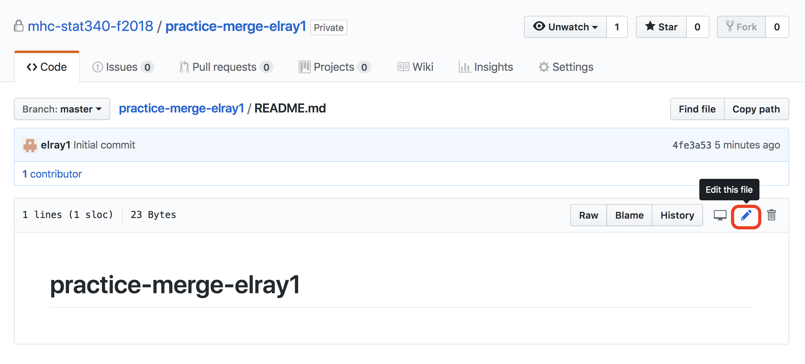
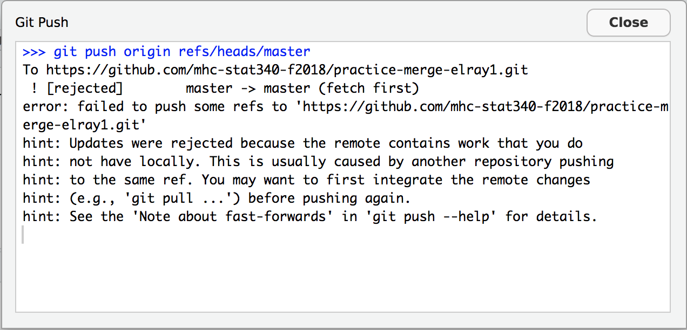
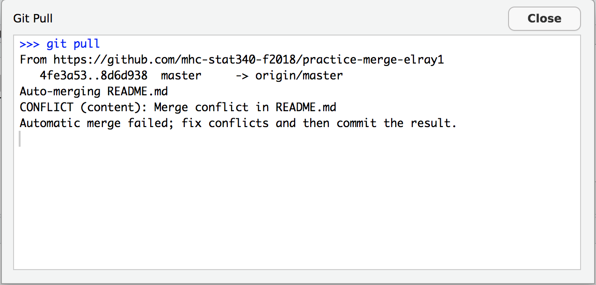
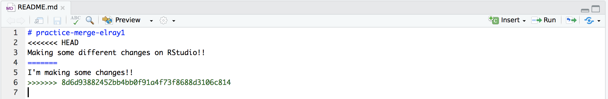
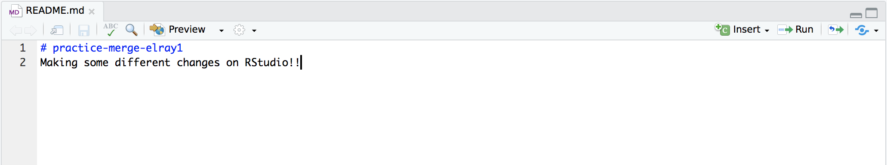

```{r, include=FALSE}
# Don't delete this chunk if you are using the mosaic package
# This loads the mosaic and dplyr packages
require(mosaic)
require(tidyr)
options(digits=3)
```

```{r, include=FALSE}
# Some customization.  You can alter or delete as desired (if you know what you are doing).

# This changes the default colors in lattice plots.
trellis.par.set(theme=theme.mosaic())  

# knitr settings to control how R chunks work.
require(knitr)
opts_chunk$set(
  tidy=FALSE,     # display code as typed
  size="small"    # slightly smaller font for code
)
# This loads the mosaic data sets.  (Could be deleted if you are not using them.)
require(mosaicData)                
```

## Purpose of this Activity

So far, we've used git in a very restricted way in this class: after I set up a repository with labs or assignments, you have been the only person making committing changes and pushing them to GitHub.  However, the real purpose of git is to facilitate collaboration on a project by multiple people.  That means that edits can be made to the same files by two different people, and git will let you merge those changes together in an intentional, safe way - and you can always go back to a previous commit in case anything gets messed up.

Today, we will get some practice with dealing with "merge conflicts" in git.  Merge conflicts arise when two people (or one person making changes on two different computers) have made different, incompatible changes to the same file.

We'll also see one way that you can set up a repository for yourself.

## Step 1: Create a practice repository on GitHub

 * Go to https://github.com/mhc-stat340-f2018
 * Click the green "New" button near the top right corner
 * Set the owner to "mhc-stat340-f2018"
 * Set the repository name to "practice-merge-githubUsername", where "githubUsername" is replaced by your actual github account user name.
 * Make it a private repository
 * Click the checkbox next to "Initialize this repository with a README"
 * Click the green "Create Repository" button

## Step 2: Clone the repository to RStudio Server

Follow the usual procedure to do this.

## Step 3: Create a merge conflict

We're going to intentionally create a merge conflict.  Ordinarily, this would occur because the same file was edited by two different people.  For today, we'll artificially create this situation by editing the file once directly through the GitHub website, and a second time in RStudio.

#### (a) Edit and commit on GitHub

 * In your web browser, go back to the GitHub website.
 * Click on the link to the README.md file.
 * Click the pencil icon near the right hand side to edit the file (see screenshot).

```{r, echo = FALSE}

```

 * Make some changes to the README.md file.  It doesn't matter what, just type something on the top couple of lines.
 * Scroll down to the bottom of the page, where you will see a dialog for committing your changes.
 * Enter a commit message, leave "Commit directly to the master branch." checked, and then click the green "Commit Changes" button.

#### (b) Edit and commit on RStudio

 * In your web browser, go back to the RStudio Server website.
 * Open up the README.md file and make some **different** changes to the top couple of lines of the file.  It doesn't matter what, as long as they're not the same changes that you made in step (a).
 * Save the file and commit as usual...
 * Try to push the commit to GitHub.  You will see a message saying "Updates were rejected because the remote contains work that you do not have locally.  This is usually caused by another repository pushing to the same ref.  You may want to first integrate the remote changes (e.g., 'git pull ...') before pushing again." (see screenshot)

```{r, echo = FALSE}

```

This is the message that you'll see when someone else has pushed some work to GitHub since the last time you pulled from GitHub.  This will sometimes lead to a merge conflict (if they edited the same files you were working on, in the same or an adjacent location), but will sometimes not be a problem (if they edited a different file, or the same file in a different location).  In this case, we will have a merge conflict.

## Step 4: Deal with the merge conflict

 * Close out of the "Git Push" error message window.
 * Click the blue "Pull" down arrow.  This will pull the updates from GitHub into your copy of the repository on GitHub.
 * You will now see a message that says "CONFLICT (content): Merge conflict in README.md  Automatic merge failed; fix conflicts and then commit the result."

```{r, echo = FALSE}

```

 * Close out of the "Git Pull" message window and the "RStudio: Review Changes" window.
 * You will see that the README.md file now has all of the changes from both the version of the file on RStudio and the version of the file on GitHub.  Below is a screenshot of my situation.  The first block, between "<<<<<<< HEAD" and "=======", is the version of the conflicting lines that were what you set up on RStudio.  The second block, between "=======" and ">>>>>>> (followed by a long string of letters and numbers)", is the version of the conflicting lines that were on GitHub.

```{r, echo = FALSE}

```

 * Your goal is now to edit the file so that it looks the way you want to.  You will have to look over all of the conflicting lines and pick the version that you want to keep, and delete everything else.  In my example, I just kept the version that I created in RStudio, and deleted the other stuff (see screenshot).  Note that in general, there might be multiple different merge conflicts in different locations in the same file.  You should make sure you've found them all!

```{r, echo = FALSE}

```

## Step 5: Commit and push the updated file to GitHub.

 * Save the README.md file.
 * Use the usual procedure to commit and push the merged files to GitHub.  Your commit message should probably describe the fact that you merged conflicts and what the conflicts were, roughly.
 * Take a look at the commit history on GitHub.
